**三维重构系统软件用户手册**

李家靖

1.软件简介
==========

1.1 软件编写背景
----------------

基于三维信息重构的质量检测系统具有广阔的应用前景，一种三维信息重构系统软件，配合相关硬件，可在生产线上实现高效、自动化、无接触的质量检测，从而提高生产效率、节省人力，同时系统准确度高、成本低，具有较高的实用价值，本软件配合相关硬件，即可实现三维信息重构与导出。

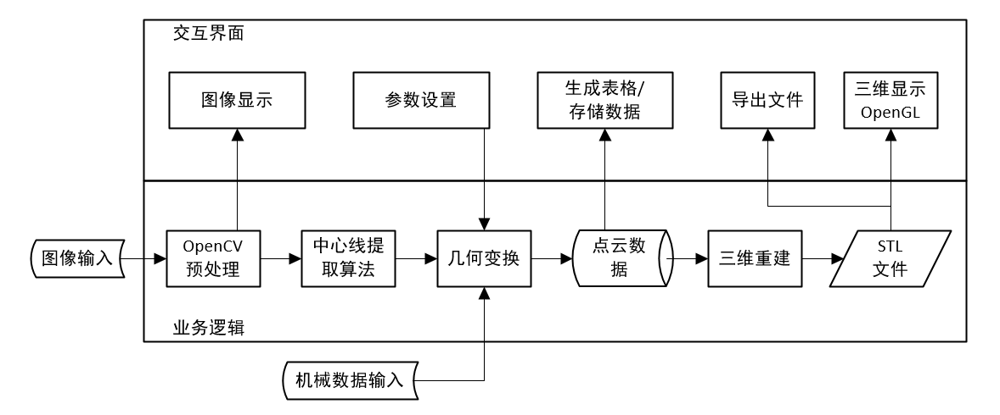

1.2 软件主要功能
----------------

**·图片预处理** 在输入图片以后，首先要对图像进行去畸变处理等，需要相机标定数据。

**·中心线提取** 图片经过预处理以后，需要进行激光光带中心线的提取。

**·点云生成**
逐个图片提取出激光光带中心线以后，需要进行几何变换才能找出光带各点在空间中的位置，并构建三维点云。

**· 曲面重建与导出**
生成点云数据后，需要对点云数据进行处理并拟合为网格曲面，并将其输出为STL格式。

**·机械连接与控制**
为了保证三维曲面模型的精度，软件扫描的运行需要与机械的运行同步，需要有用于机械控制或机械数据输入的硬件接口。

2.软件的安装和运行
==================

2.1 软件的安装
--------------

软件安装之前，请**确保软件运行平台为windows8及以上**，本软件为开源项目，其最新版本可以在GitHub网站上获取，网址为：

<https://github.com/VASIMRLJJ/qt2/releases>

打开此网址后，可以看到如下界面，在该界面中下载最新版本所对应的setup.exe文件即可：

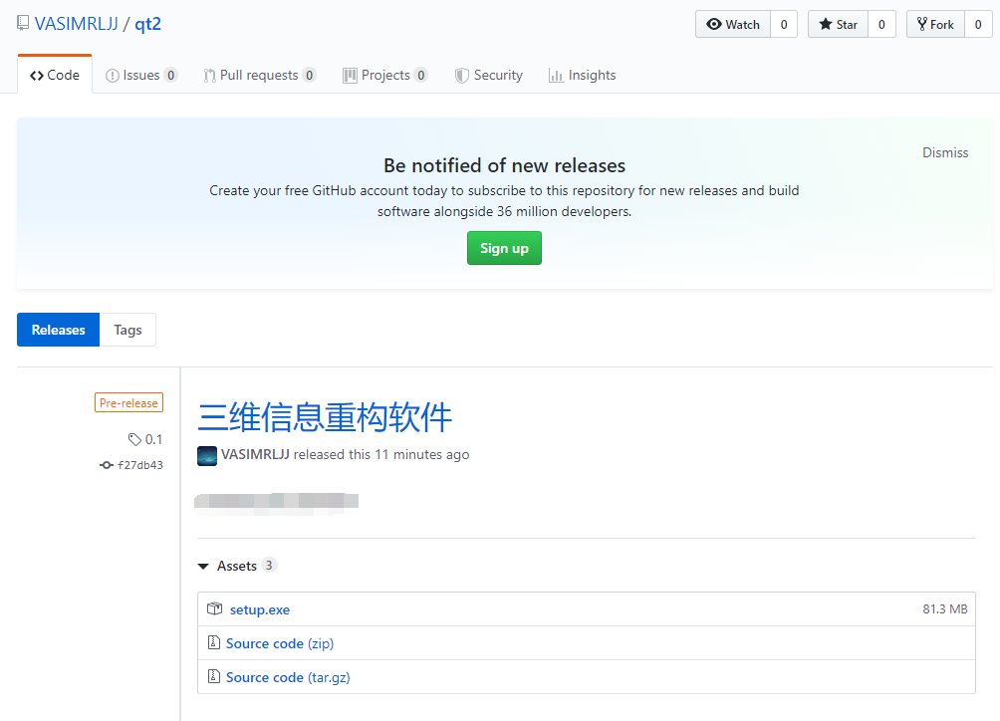

下载后，可以得到如图所示的一个exe文件：

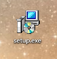

双击运行该文件，进入安装流程，首先选择安装语言，可选中文或英语，如下图所示：

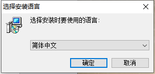

选择好语言后，进入安装向导，在向导中点击“下一步”：

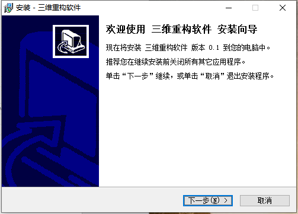

在弹出的窗口中选择软件的安装位置，选择完成后点击“下一步”：

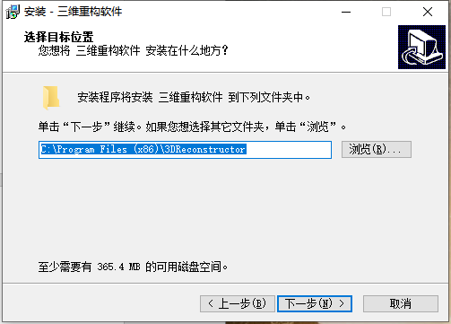

在开始菜单中添加软件快捷方式，可以更改开始菜单文件夹命名：

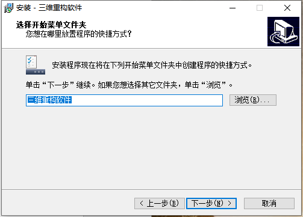

完成所有设置后，确认无误点击安装：

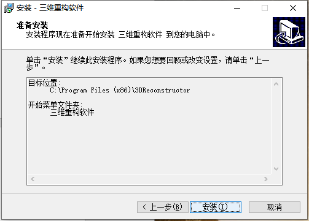

软件安装过程如下图所示：

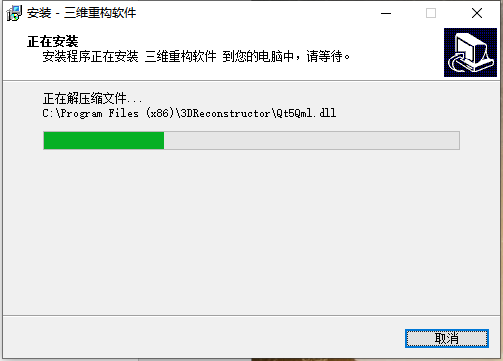

2.2 软件的运行
--------------

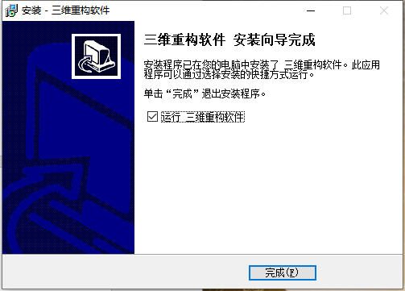

安装完成后，勾选运行，软件会直接运行，如果不想立即运行，可以在开始菜单中找到软件的快捷方式单击运行：

运行之前**一定要确保硬件部分已经正确连接，同时相关驱动已经正确安装。**

运行前软件会与一个启动过程，表现为黑色命令行窗口，这时不要对该命令行窗口做任何操作，软件启动后会正常进入GUI界面，如下图所示：

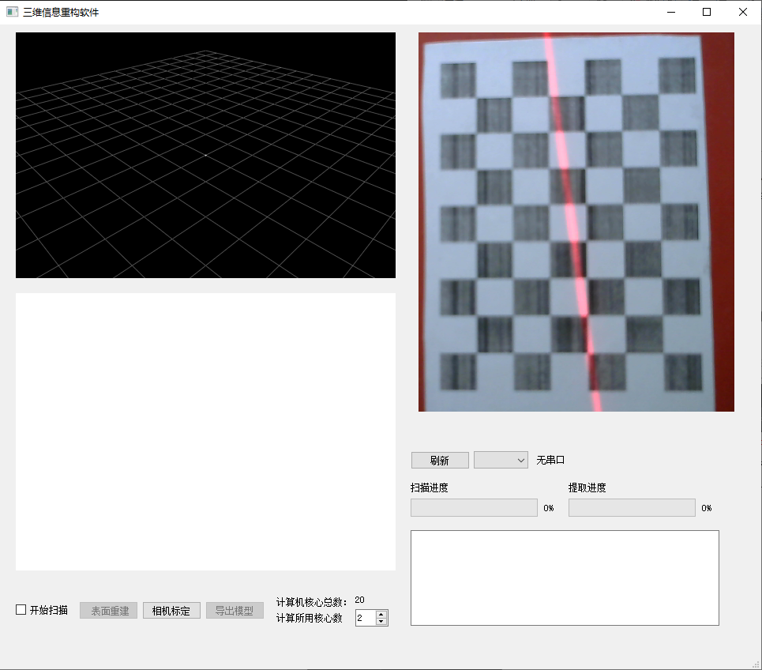

2.3 软件的卸载
--------------

软件的卸载流程与常规软件相同，需要在“控制面板”-\>“程序与功能”内完成卸载，如果使用windows10系统可以直接在“设置”中卸载，点击开始菜单中的“设置”-\>“应用”-\>“应用和功能”，找到三维重构软件，点击“卸载”按钮：

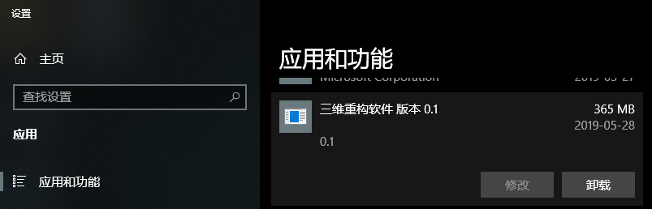

点击该按钮以后弹出如下对话框，点击“是”开始卸载：

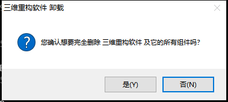

卸载过程如下图所示：

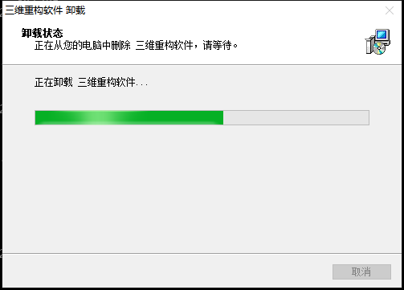

卸载完成后，弹出如下对话框：

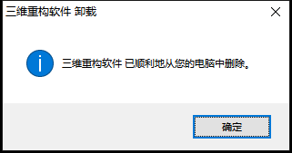

3.软件使用流程及用户界面
========================

3.1 相机及串口连接测试
----------------------

硬件连接好以后，首先需要测试其是否可用，右键“此电脑”，选择“管理”，在“计算机管理”窗口中选择“设备管理器”，如下图所示：

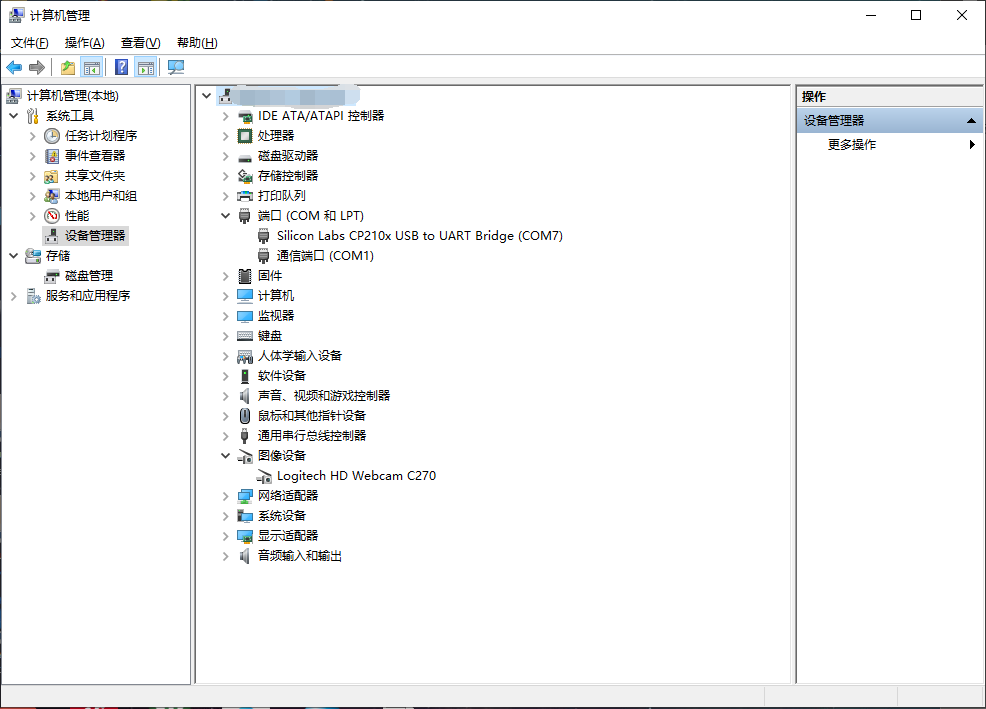

如果在“端口”菜单中有串口芯片型号字样，同时在“图像设备”菜单中有摄像机型号字样的设备，证明驱动已经正确安装，否则请尝试重新安装驱动，注意：**如果计算机还有其他图像设备或摄像机，请将其全部禁用。**

确认驱动安装无误后，运行软件，可以看到软件右侧图像显示窗口中显示有摄像机捕获的实时图像，点击“刷新”按钮，可以看到按钮右侧下拉菜单中出现串口列表，选中某一串口时右侧显示出相应的硬件信息，如下图所示：

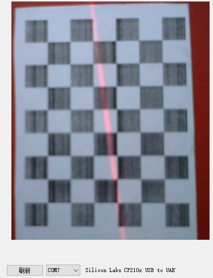

3.2 相机的标定
--------------

在硬件连接正常的基础上，点击左侧“相机标定”按钮，弹出如下对话框：

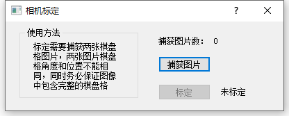

对话框中已经详细描述了使用方法，首先准备好标定板，为7\*9棋盘格，每个大小为10\*10mm，移动标定板使得图像窗口中有完整的棋盘格图像，如下图所示：

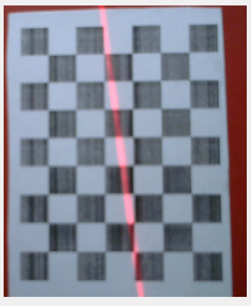

点击“捕获图像”，捕获成功则弹出如下“success”对话框，关掉后发现“捕获图片数”变为1。

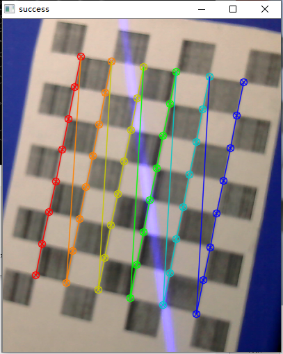

如果捕获失败则弹出如下“错误”对话框，此时捕获图片数不会增加。

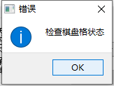

调整棋盘格角度，重复之前操作，成功捕获图片后“捕获图片数”变为2，此时“标定”按钮为可用状态，如下图所示：

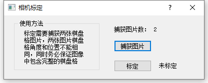

点击“标定”按钮，出现“标定成功”字样代表完成标定，如下图所示：

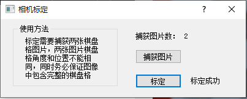

3.3 三维扫描
------------

将实验台置于黑暗环境下，调整
“计算所用核心数”的值，勾选“开始扫描”即可开始扫描，扫描过程中进度条分别显示扫描进度与提取进度，如下图所示：

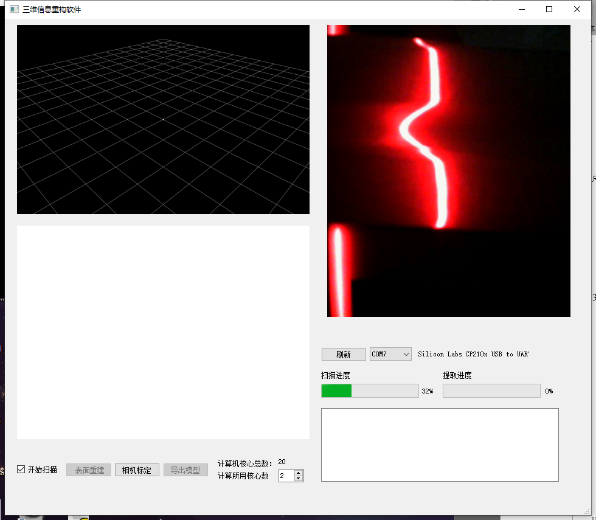

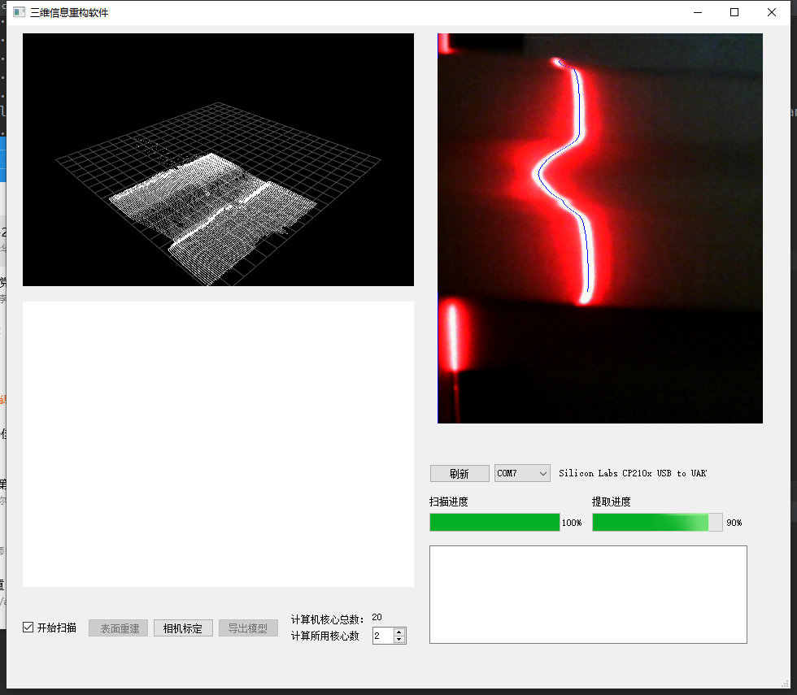

在扫描过程中，左侧点云显示框中显示出点云的三维图像；当两个进度条都为百分之百时，标志着扫描完成。

3.4 曲面重建
------------

曲面重建的按钮为窗体左下方的“表面重建”按钮，在初始时该按钮不可用，只有在扫描过程完成以后，即为“开始扫描”单选框未勾选，同时点云窗口中有点云数据显示时，“表面重建”按钮才会处于可用状态，点击“表面重建”按钮后，右下方窗口中打印运行状态，左下方曲面显示框中出现曲面即标志着重建完成，如下图所示：

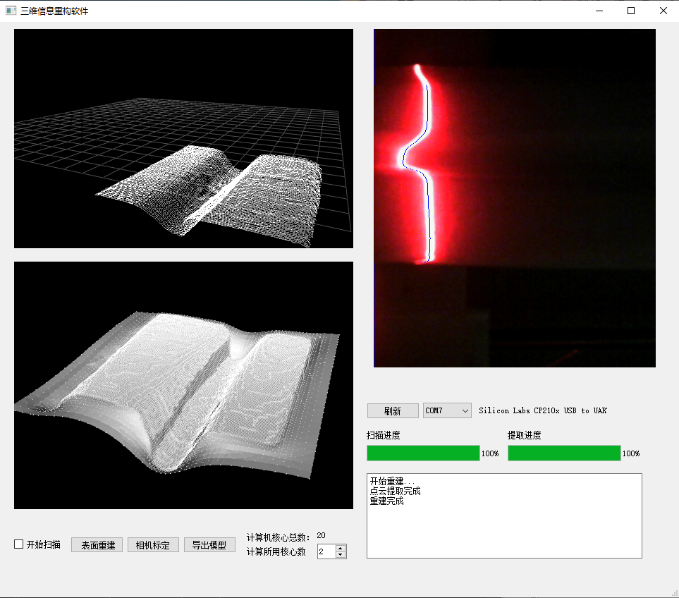

3.5 数据导出
------------

在曲面重建完成后，“导出模型”按钮可用。点击“导出模型”按钮后，会弹出一个文件保存对话框，如下图所示：

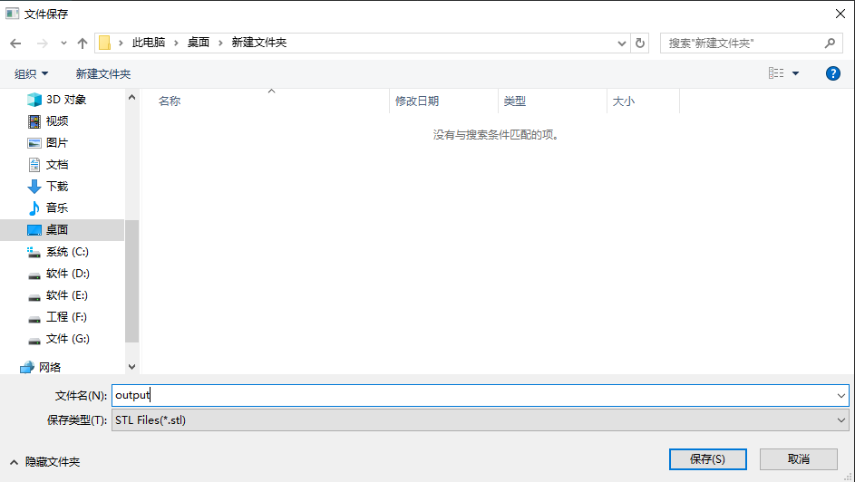

选择保存路径，修改文件名后，即可输出STL模型，该模型可以用Windows10自带的3d-builder打开，如下图所示：

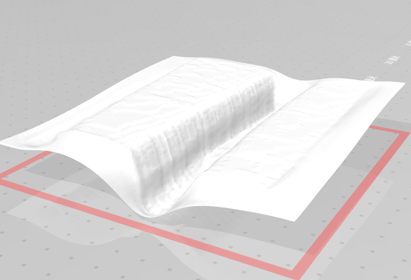

4.版本历史
==========

| 2019.5.28 | 0.1 | 李家靖 |
|-----------|-----|--------|

